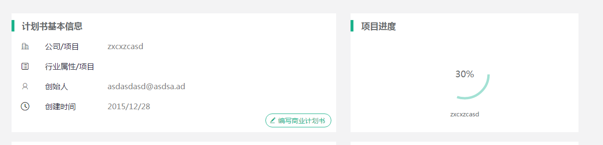

## state与props
props->dom.attributes,即标签属性    
state->model,即与视图进行沟通的model,如checkbox.checked,通过setState的方式,动态进行修改,可通过props的方式初始化数据    
state,维护视图状态的模型


## 组件与布局
布局,大概就是PM所掌握的最小UI单元,`做一个投标管理,上面是状态,下面是数据,其实跟招标管理长得一样,很简单的`,以上就是我某次收到的曹姓PM的需求描述,具体的属性,内容会根据用户需求随便修改,具体接口跟后台商量,但是整体风格就是`跟招标管理一样`,非常明确的描述....    
我会将PM看见的布局提出来,但我不想在使用布局是也用组合的方式,我喜欢用继承的方式(受EXT影响),这样我在命名是就可以使用`业务模型+布局`方式    
比如,`项目进度,跟计划书基本信息一样,上面显示项目进度的标题,里面显示一个进度条`

代码
```
// 某个PM看得见的布局
import React, { Component } from 'react';

export default class Panel  extends Component {
  constructor(props) {
      super(props);
      this.state={
        title:"标题",
        body:(<p>里面的那个</p>)
      }
  }
  render() {
    console.log(this.state)
    return (
      <div>
         <h3>{this.state.title}</h3>
           {this.state.body}
      </div>
    );
  }
};


//计划书基本信息
import React, { Component } from 'react';
import Panel from '../layout/Panel'
export default class BasePanel  extends Panel {
    constructor(props){
      super(props);
      this.state ={
        title:'计划书基本信息',
        body:(<BaseComponent />)
      };
    }
};


class BaseComponent extends Component{
  render(){
    return (<div>基本信息xxx</div>)
  }
}

//项目进度
import React, { Component } from 'react';
import Panel from '../layout/Panel'
export default class ProgressPanel  extends Panel {
    constructor(props){
      super(props);
      this.state ={
        title:'项目进度',
        body:(<div>进度条</div>)
      };
    }
};
```
继承布局主要继承render的结构,通过参数(state)的方式传递子组件


## css in js
`这个组件就一种颜色,不要让他老变`,`先点这个,在点这个,然后回去,看,这个按钮颜色就变了`我常听到PM/产品的一句话,其实就是css冲突,听到的越多,就越感觉,依赖选择器的方式与PM的冲突越来越大- -    
对于PM来说,这个布局/组件就是这种颜色,内部交互维护这种样式的修改,为什么会在加载其他组件/样式后,他的样式就变了呢-。-除了告诉他,选择器冲突这种他绝壁不在乎的词意外,还可以选择css-modules    
依然使用一下规则,描述组件使用less/sass的继承方式,开头一定用组件名,用以解决冲突,故,此处引用css-modules所做的事,就是将组件名加入hash值,用以杜绝组件名的冲突

